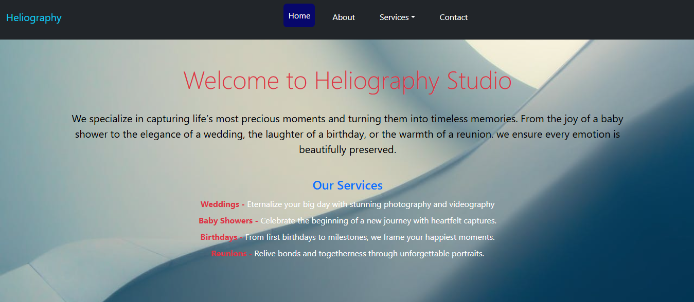
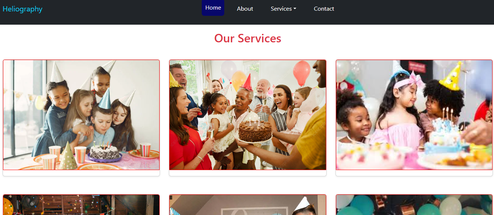
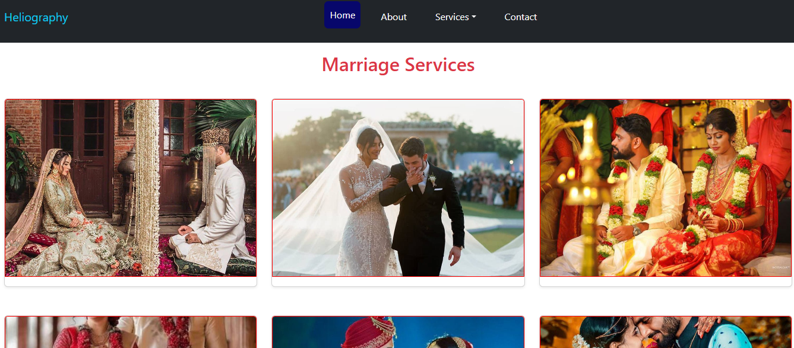
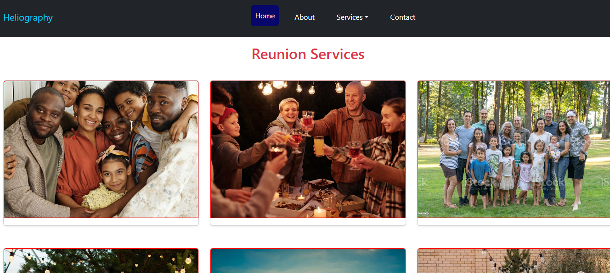
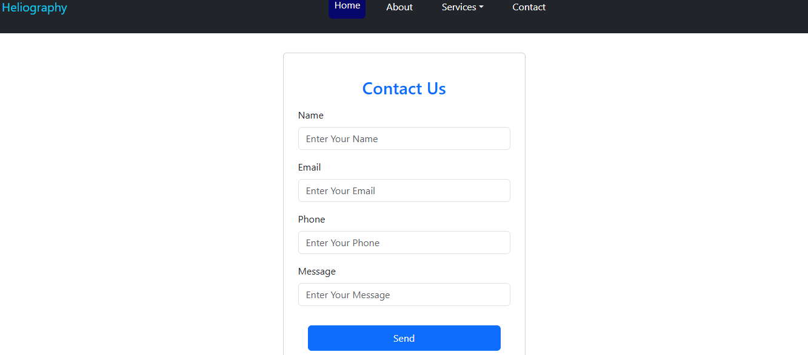
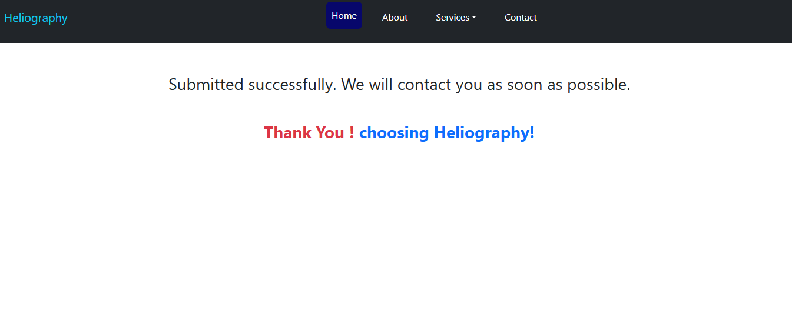

# Heliography Studio 📸

Heliography Studio is a photography website built with **Django**.  
It’s designed to capture and showcase special moments such as **marriages, baby showers, birthdays, and reunions**.

---

##  Features
- User-friendly navigation bar
- Category-wise image gallery
- Admin panel for managing categories and images
- Responsive design for all devices
- Future: Wishlist, Cart, and Payment system (ecommerce features)

---

##  Tech Stack
- **Backend:** Django, Python
- **Frontend:** HTML, CSS, Bootstrap
- **Database:** SQLite 
- **Version Control:** Git & GitHub

---

##  Project Structure

Django-Heliography-Studio_project
| - contact #app
| - events  #app
| - Heliography # main project
| - home    #app
| - media   # events/All the images
| - static # css/style.css
           # images/bg-img.jpg,home.jpg
| -templates # contact/contact.html,success.html
             #  about.html
             # base.html
             # events_list.html
             # home.html
| - db.sqlite3
| - manage.py
| - README.md

##  virtual enviroment

   virtual environment name - env
   activate the environment - env/scripts/activate
   change directory - cd Heliography
   Run server command - python manage.py runserver
   Migrations command - python manage.py makemigrations
                        python manage.py migrate

## ScreenShots

#Home-Page 

#About-Page

#Services
   | - Birthday
   | - Reunion
   | - Baby shower

#Contact
     | - #thank you page
 

      # Thank You Page

